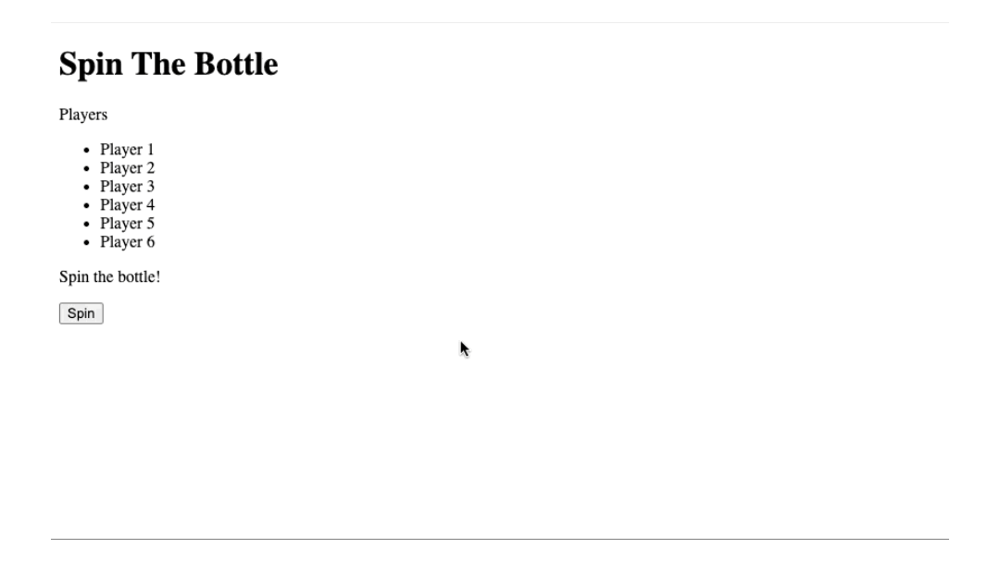
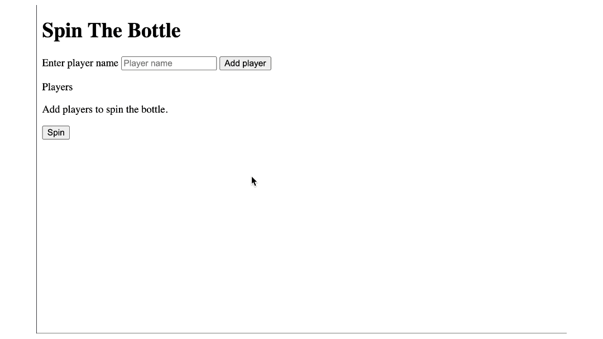

# spin the bottle

- [spin the bottle](#spin-the-bottle)
  - [learning](#learning)
  - [about](#about)
  - [stages](#stages)
    - [1: lets set the stage](#1-lets-set-the-stage)
    - [2: spin the wheel](#2-spin-the-wheel)
    - [3: player recruit time](#3-player-recruit-time)
 
## learning
it is a little game to learn event listeners, work with forms, create dom elements, and manipulate them with javascript

## about
"spin the bottle" is a fun and interactive web application designed to facilitate the random selection of players for games, activities, or any scenario where randomness adds excitement. inspired by the classic party game, this project brings a modern twist to the concept, leveraging web technologies to create a dynamic and engaging user experience.

## stages
### 1: lets set the stage 
<details>
<summary>set the basic html structure for the game</summary>

#### 1.1 description
welcome to the first stage of our exciting project - "spin the bottle"! this isn't your average party game. we're taking it up a notch and digitizing the fun. but before we can start spinning, we need to set the stage.

this stage is all about creating the html structure of our web app. picture this as the skeleton of our game. it's the basic structure around which everything else is built.

we're going to need a few things:
1. **title**: every great game needs a catchy title. create a heading for our game that says "spin the bottle".
2. **list of players**: this is where the names of our brave participants will be displayed. think of it as the game's roll call.
3. **status text**: this is where we'll announce the chosen player each time the bottle spins. the tension! the suspense!
4. **spin button**: the button that starts it all. the heart of our game. when this button is clicked, the bottle spins, and a random player is chosen.

remember, html is the backbone of any web page. it might not look like much on its own, but it's the foundation upon which we build everything else. so, let's get this right!

#### 1.2 objectives
in this stage, you should have:
* `<h1>` tag: to create the heading "spin the bottle".
* `<p>` tag with id: to create a paragraph with the id "players-text" to display "players".
* `<ul>` tag with id: to create an unordered list with the id "players".
  * `<li>` tags: to create list items for each player. there should be 6 players.
  * the player names for this stage should be like the example. name them "player 1" to "player 6".
* another `<p>` tag with id: to create a paragraph with the id "status" to display "spin the bottle!".
* `<button>` tag with id: to create a button with the id "spin" and the text "spin".

#### 1.3 examples
example 1:


</details>

### 2: spin the wheel
<details>
<summary>implement the random player pick function</summary>

#### 2.1 description
alright, it's time to ramp things up a notch! remember that list of players you've been working with? well, it's time to give them a spin. literally. in this exciting stage, you'll be adding a new feature to your project - the ability to choose a random player from your list.

here's how it's going to work:
- **button press**: when the "spin" button is clicked, we want our program to leap into action. it's showtime!
- **status update**: as soon as that button is clicked, we want our status text to change. it should now read "spinning...". this will give our users the thrill of anticipation, as they wait to see who the lucky player will be.
- **the wait**: but we don't want to reveal our chosen player too quickly. oh no, we're going to make them wait for it. for two whole seconds, in fact.
- **the reveal**: and finally, after those suspense-filled two seconds have passed, the status text should change once again. this time, it should show the name of the chosen player. 

so, are you ready to take on the challenge? this stage will test your knowledge of javascript.

#### 2.2 objectives
in this stage:
- upon clicking the spin button, the status text should change to "spinning...".
- choose a random player from the list of players.
- after a 2-second delay, the status text should update to show the selected player.

#### 2.3 examples
example 1:



</details>

### 3: player recruit time
<details>
<summary>add a form to collect the player names</summary>

#### 3.1 description
welcome to the final stage! this stage is all about making our spin the bottle game interactive and user-friendly. we're going to create a form to recruit our players and add them to the game.

here's the challenge:
1. **form creation**: you'll need to add a form to your web page. this form will be used to gather the names of our eager participants who can't wait to play spin the bottle.
2. **status update**: before any player is added, our status should show a message that says: "add players to spin the bottle." this is your chance to give your users some guidance and let them know what they need to do next.
3. **form submission**: this is where things get tricky. when a user submits the form, we want to add the player's name to our list, **but we don't want the page to reload**. your challenge is to prevent the default form submission behavior and add the player to our list without refreshing the page. also, if the player name already exists in the list, you should not add it and instead update the status text with "player already exists!".
4. **keep the game going**: once you've added the new player to the list, clear the input and everything else should work just like before. the bottle should spin, a player should be chosen, and the status should be updated.

good luck, coders! may the best player win!

#### 3.2 objectives
in this stage, you should:
- delete the demo players (player 1, player 2, ...), that is, list items and add a form element to collect player names above the ul element.
- change the text of the p tag having id="status" to "add players to spin the bottle."
- include a label with the text "enter player name" for the input.
- include input field to enter the player name with id "player-name" and placeholder "player name".
- add a button with id "add-player" and text "add player" to submit and add the player.
- update the player list **dynamically** when a new player is added.
- set an initial status message to prompt the user to add players.
- **prevent the default form submission behavior when adding a player**.
- clear the input after form submission.
- prevent adding the same player name to the list and warn the user by updating the status text to "player already exists!".

#### 3.3 examples
example 1:



</details>

[<<](https://github.com/eucarizan/front-end/blob/main/README.md)
<!--
:%s/\(Sample \(Input\|Output\) \d:\)\n\(.*\)/```\r\r**\1**\r```\3/gc

### 0: 
<details>
<summary></summary>

#### 0.1 description

#### 0.2 objectives

#### 0.3 examples

</details>
-->

