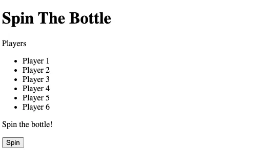

# spin the bottle

- [spin the bottle](#spin-the-bottle)
  - [learning](#learning)
  - [about](#about)
  - [stages](#stages)
    - [1: lets set the stage](#1-lets-set-the-stage)
 
## learning
it is a little game to learn event listeners, work with forms, create dom elements, and manipulate them with javascript

## about
"spin the bottle" is a fun and interactive web application designed to facilitate the random selection of players for games, activities, or any scenario where randomness adds excitement. inspired by the classic party game, this project brings a modern twist to the concept, leveraging web technologies to create a dynamic and engaging user experience.

## stages
### 1: lets set the stage 
<details>
<summary>set the basic html structure for the game</summary>

#### 1.1 description
welcome to the first stage of our exciting project - "spin the bottle"! this isn't your average party game. we're taking it up a notch and digitizing the fun. but before we can start spinning, we need to set the stage.

this stage is all about creating the html structure of our web app. picture this as the skeleton of our game. it's the basic structure around which everything else is built.

we're going to need a few things:
1. **title**: every great game needs a catchy title. create a heading for our game that says "spin the bottle".
2. **list of players**: this is where the names of our brave participants will be displayed. think of it as the game's roll call.
3. **status text**: this is where we'll announce the chosen player each time the bottle spins. the tension! the suspense!
4. **spin button**: the button that starts it all. the heart of our game. when this button is clicked, the bottle spins, and a random player is chosen.

remember, html is the backbone of any web page. it might not look like much on its own, but it's the foundation upon which we build everything else. so, let's get this right!

#### 1.2 objectives
in this stage, you should have:
* `<h1>` tag: to create the heading "spin the bottle".
* `<p>` tag with id: to create a paragraph with the id "players-text" to display "players".
* `<ul>` tag with id: to create an unordered list with the id "players".
  * `<li>` tags: to create list items for each player. there should be 6 players.
  * the player names for this stage should be like the example. name them "player 1" to "player 6".
* another `<p>` tag with id: to create a paragraph with the id "status" to display "spin the bottle!".
* `<button>` tag with id: to create a button with the id "spin" and the text "spin".

#### 1.3 examples
example 1:



</details>

[<<](https://github.com/eucarizan/front-end/blob/main/README.md)
<!--
:%s/\(Sample \(Input\|Output\) \d:\)\n\(.*\)/```\r\r**\1**\r```\3/gc

### 0: 
<details>
<summary></summary>

#### 0.1 description

#### 0.2 objectives

#### 0.3 examples

</details>
-->

